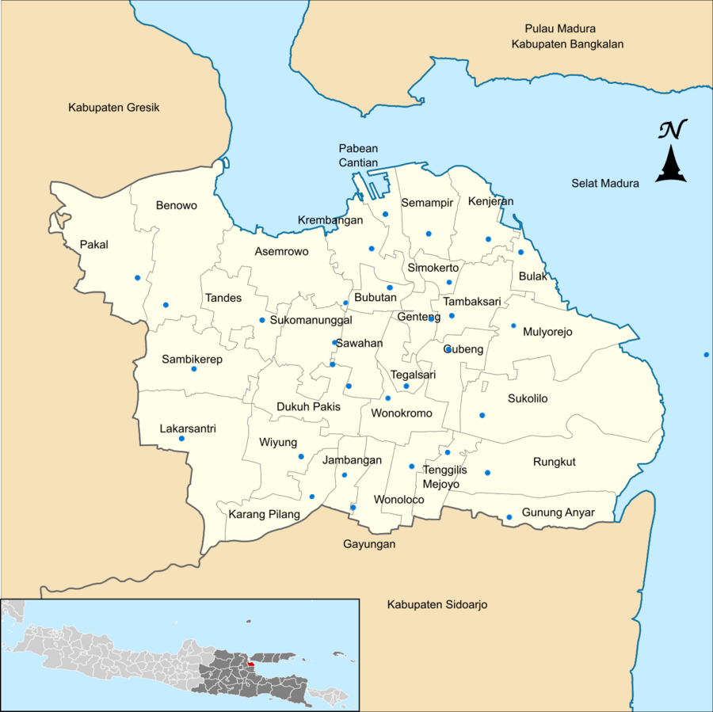
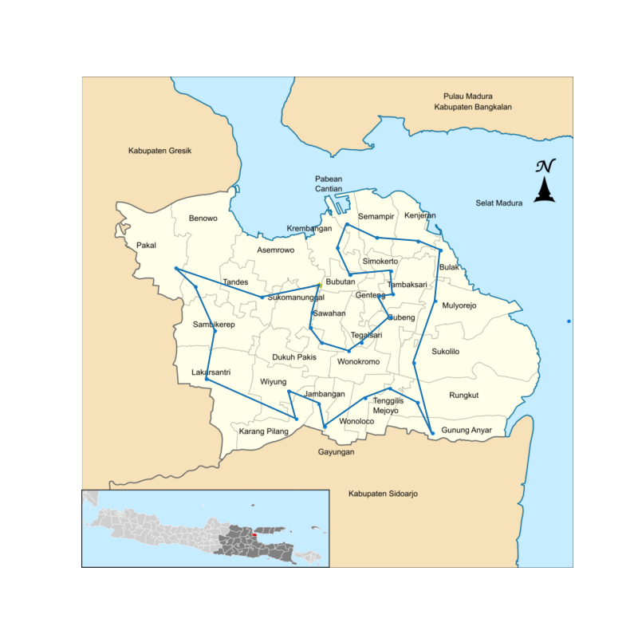

# Optimasi Rute Antar Kantor Kecamatan (TSP) dengan Ant Colony Optimization

*[🇬🇧 Read in English (Baca dalam Bahasa Inggris)](README.md)*

---

Repository ini berisi skrip Python yang bertujuan untuk menyelesaikan masalah *Traveling Salesman Problem* (TSP) guna mencari rute kunjungan paling efisien antar kantor kecamatan. 

Dengan memanfaatkan algoritma **Ant Colony Optimization (ACO)**, skrip ini menghitung rute optimal dan menyajikan visualisasi jalur yang dapat diikuti dengan jarak tempuh minimum. Program ini telah dirancang secara dinamis sehingga dapat dengan mudah digunakan untuk berbagai kota seperti Surabaya, Sidoarjo, hingga Depok.

## Fitur Utama

- **Konfigurasi Multi-Kota (Dinamis)**: Dilengkapi dengan blok konfigurasi terpusat. Cukup ubah variabel `CITY_NAME`, program akan secara otomatis menyesuaikan pembacaan titik koordinat dan gambar peta.
- **Smart Image Detector & Safe Saving**: Sistem secara pintar mendeteksi ketersediaan peta dalam berbagai format (`.png` atau `.jpg`) dan secara otomatis membuat struktur folder *output* (`assets/results/`) jika belum tersedia untuk mencegah *error*.
- **Algoritma Optimasi Berkinerja Tinggi**: Menggunakan *Ant Colony Solver* yang telah divektorisasi dengan NumPy, memastikan pencarian solusi rute terbaik berjalan cepat.
- **Visualisasi Peta & Rute**: Menghasilkan gambar rute *point-to-point* yang langsung ditumpangkan (*overlay*) di atas peta asli kota.
- **Analisis dan Statistik**: Menyediakan perhitungan statistik tabel menggunakan Pandas untuk membandingkan kinerja hasil algoritma konvergen murni dengan batasan waktu (terjadwal).

## Teknologi yang Digunakan

- **Python 3.x**: Bahasa pemrograman utama.
- **NumPy**: Mempercepat operasi matematis dan pergerakan semut (vektorisasi) di dalam algoritma.
- **Pandas**: Digunakan untuk analisis komparasi komputasi statistik pada hasil akhir optimasi.
- **Matplotlib**: Engine utama untuk merender titik koordinat dan jalur rute di atas gambar peta.

## Cara Penggunaan

1. **Instalasi Dependensi**: Pastikan Anda telah menginstal semua *library* pendukung. Anda dapat menginstalnya melalui terminal menggunakan:
   ```bash
   pip install -r requirements.txt
   ```
   *(Atau secara manual: `pip install numpy pandas matplotlib ipython argparse`)*

2. **Eksekusi Program**: Anda dapat menjalankan skrip optimasi ini langsung melalui terminal dengan berbagai opsi dinamis menggunakan argumen CLI. Tidak perlu lagi mengubah kode secara manual!
   ```bash
   # Jalankan dengan parameter default (Kota: Surabaya, Semut: 64, Iterasi: 100)
   python src/route_optimization.py

   # Jalankan untuk kota lain dengan parameter kustom
   python src/route_optimization.py --city Sidoarjo --ants 100 --iterations 200

   # Sesuaikan hiperparameter ACO (alpha: bobot feromon, beta: bobot jarak)
   python src/route_optimization.py --city Depok --alpha 1.5 --beta 2.0
   
   # Jalankan dan buat analisis statistik tambahan
   python src/route_optimization.py --city Surabaya --stats

   # Tampilkan menu bantuan untuk melihat seluruh opsi perintah
   python src/route_optimization.py --help
   ```

3. **Cek Hasil**: Gambar hasil pemetaan awal (`Kecamatan.png`) dan hasil optimasi rute (`path.png`) akan otomatis tersimpan dengan rapi di dalam direktori `assets/results/`.

## Contoh Hasil

*(Peta Asli Kota Surabaya)*  


*(Contoh Hasil Jalur Optimal - TSP)*  


## Lisensi

Proyek ini dilisensikan di bawah **Apache License, Version 2.0**[cite: 6] - lihat file [LICENSE](LICENSE) untuk detail mengenai syarat penggunaan, reproduksi, dan distribusi.